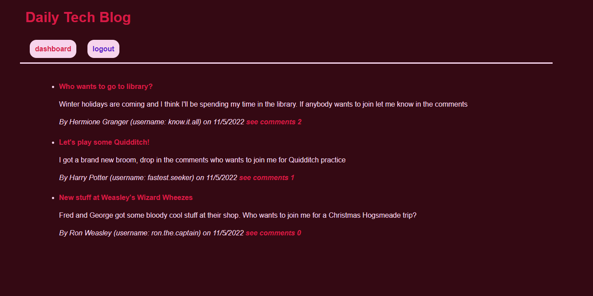
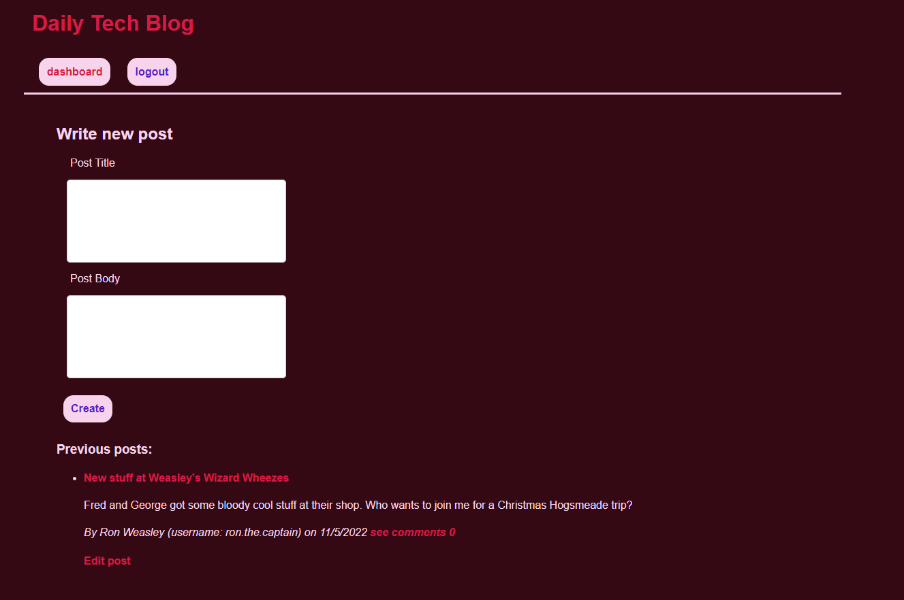
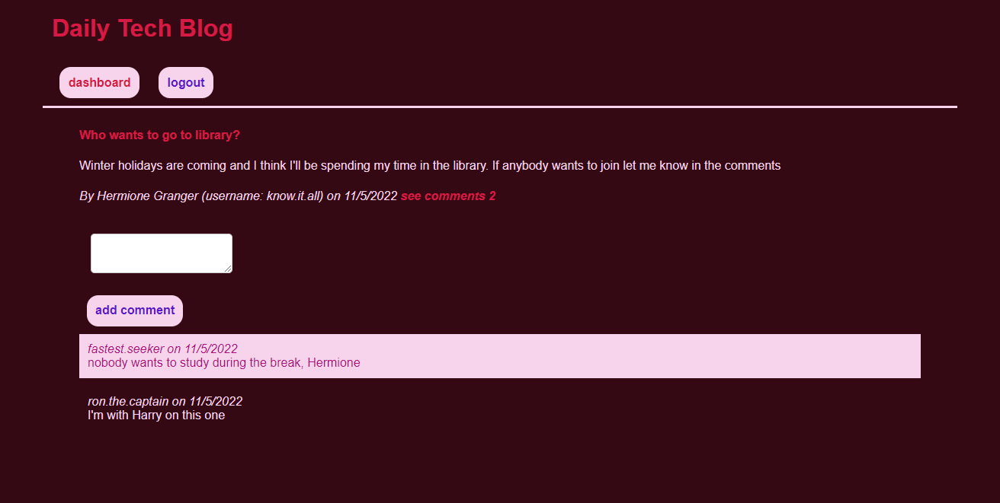

# Welcome to the Daily ~~Prophet~~ Tech Blog 📜
### _This application is a perfect place to post your findings in tech world and share it with your friends!_
### _It's super easy to use and navigate, once you create an account and log in, you'll have an access to a dashboard where you can post, comment, edit and delete_

### Navigation
 
- [**Description**](#description)
- [**Sample screenshots**](#sample)
- [**Contact Info**](#contacts)
  
> ### **Application Description**
This full stack application was designed using the best **RESTful API** practices. All the incoming data is stored in MySQL database and is accessed through Sequelize framework.  
The front-end was built with the implementation of **Handlebars.js** and **CSS3**.  Personal information is **not** accessible through cookies and passwords are hashed through **bcrypt.** 
Once loaded, the user is presented with a homepage where they can see all posts created. To see each post individually and comment on it the user needs to login, if they do not have an existing account, users will be presented with a sign up form as well. Once the user is logged in, their credentials are stored in the session and even if the user closes the browser and reopens again, they're still logged in.  
If user clicks on **dashboard** they will be presented with an empty form to write a new post that will be visible to other users and other users will be able to comment on that post. 
Once the user is done, they can click 'logout' and their session (with credentials) will be destroyed

_**The link to application is**_ [HERE](https://secret-coast-89733.herokuapp.com/) 
  
> ### **Sample Screenshots**
Please see the screenshots of the application below: 
 
 
 

  
> ### **Contacts**📲
If you have any ideas/suggestions to take this application to further improvements, please feel free to reach out [here](https://www.linkedin.com/in/valeriya-kim-763572204/)  
**Thank you for visiting!**